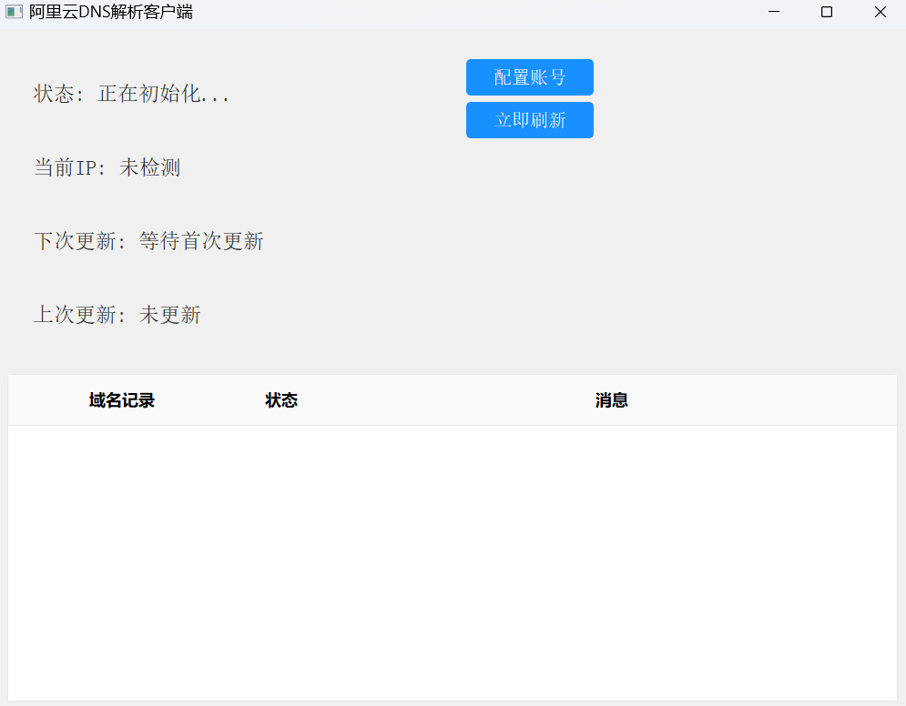
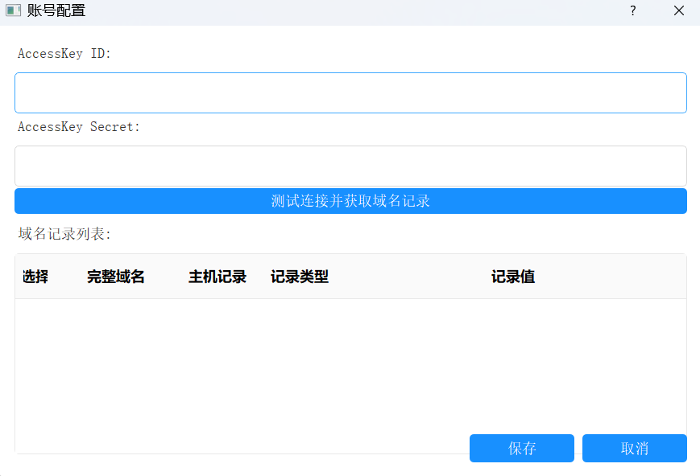

# aliyun-ddns
aliyun-ddns-client(阿里云DDNS客户端)

# 特征
* 支持阿里云域名解析的动态域名更新
* 支持多域名解析记录的更新
* 支持IPv4和IPv6的动态域名更新

# 下载 / How
* 下载直接运行: https://github.com/dawn-lee/aliyun-ddns/releases/tag/1.0.0
* 账户配置完成即可使用

# 自行编译
* 克隆项目到本地
* 安装依赖 pip install -r requirements.txt
* 运行 python main.py

# 打包
* 安装依赖 pip install -r requirements.txt
* 运行 python .\tools\build.py

# 

